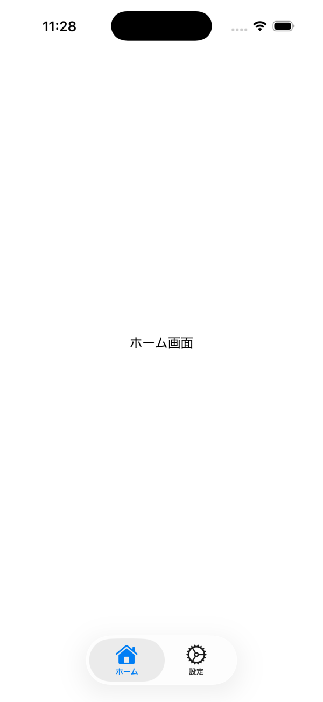
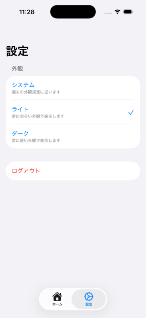

# SwiftUI Settings Sample

SwiftUIで実務アプリを想定した設定画面のUIサンプルです。  
Form / List / enumによる外観設定など、一般的な設定画面の構成を再現しています。

## Features
- SwiftUI + Form による設定画面
- enum を使った外観（ライト / ダーク / システム）の管理
- List + Checkmark による選択UI
- 設定変更時に UserDefaults へ保存し、アプリ起動時に設定を読み込み外観を復元  
- 画面間共有のために @EnvironmentObject を利用

## Screens
- 設定画面（Form）
- 外観切り替え（ライト / ダーク / システム）  

## ScreenShot
Settings Screen  
Appearance Selection Screen    

  
  

## Tech Stack
- Swift
- SwiftUI
- Xcode
- UserDefaults  

## Architecture
- MVVM  

## Notes
- 設定情報を管理するために ObservableObject を定義
- View の再生成時にも状態が保持されるよう @StateObject を使用
- 画面間共有のために @EnvironmentObject を利用

## 工夫した点
- 設定項目の追加・変更を想定し、Viewを分割
- SwiftUIの状態管理を意識して実装

## 今後の改善
- MVVM構成をより明確にし、ViewModel単体でテスト可能な設計へ改善予定
- 設定項目増加時の構成整理
